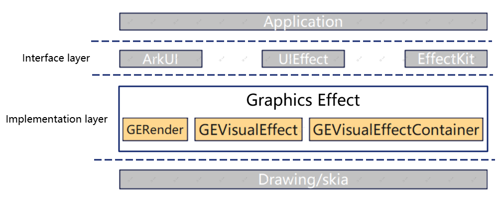

# graphics_effect

## Description
graphics_effect is an important component of OpenHarmony's graphics subsystem, providing the necessary visual effects algorithm capabilities for the graphics subsystem, including blur, shadow, gradient, grayscale, brighten, invert, enhance, etc.

## Software Architecture

The layered description of Graphics Effect is as follows:

• Interface layer: Graphics Effect opens its capabilities to the outside world through ArkUI, UIEffect, and EffectKit.

• Implementation layer: divided into three modules: GERender, GEVisualEffect, and GEVisualEffectContainer.
| Modules                                          | Capability description                                                                 |
|--------------------------------------------------|----------------------------------------------------------------------------------------|
| GERender(rendering)                              | provides drawing capabilities and draws the effects of GEVisualEffect onto the target. |
| GEVisualEffect(visual effect)                    | implementation of specific visual effect capabilities.                                 |
| GEVisualEffectContainer(visual effect container) | convenient integration of multiple visual effects.                                     |

• Engine encapsulation layer: encapsulation layerof 2D engine provided by the system.

## Installation

Not involved

## Instructions

The capabilities of this component have been integrated into system UI rendering scenarios such as the desktop, status bar, and control center, and users can directly operate and use it and experience the corresponding effects.
