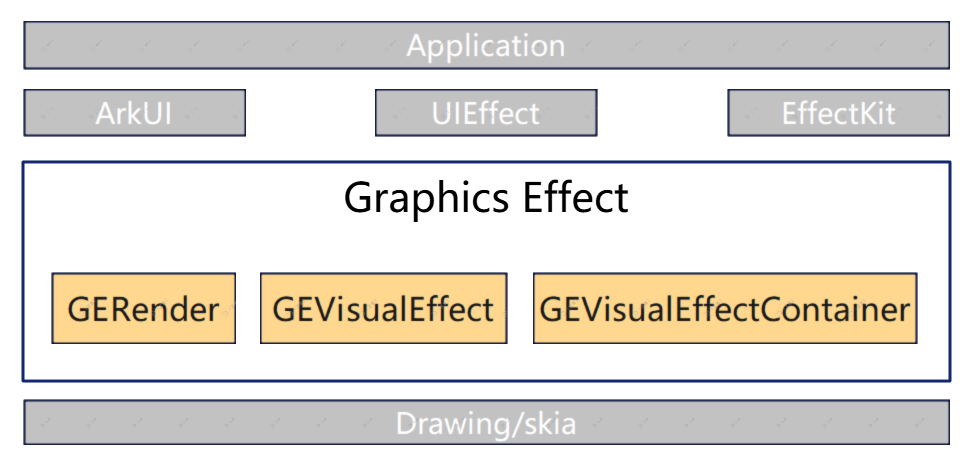

# graphics_effect

#### 介绍
Graphics Effect是OpenHarmony图形子系统的重要部件，为图形子系统提供必需的动视效算法能力，包括模糊、阴影、渐变、灰阶、提亮、反色、取色等。

#### 软件架构

Graphics Effect的分层说明如下：

• 接口层：Graphics Effect通过ArkUI、UIEffect、EffectKit对外开放能力。

• 实现层：分为GERender、GEVisualEffect、GEVisualEffectContainer三个模块。
| 模块                            | 能力描述                            |
|-------------------------------|---------------------------------|
| GERender（渲染）                  | 提供绘制能力，将GEVisualEffect效果绘制到目标上。 |
| GEVisualEffect（视效）            | 具体视效能力的实现。                      |
| GEVisualEffectContainer（视效容器） | 多个视效方便集成。                       |

• 引擎封装层：系统提供的2D引擎封装层。

#### 安装教程

不涉及

#### 使用说明

在桌面、状态栏、控制中心等系统UI场景中已经集成了该部件的能力，用户可直接操作使用并体验相应效果。
